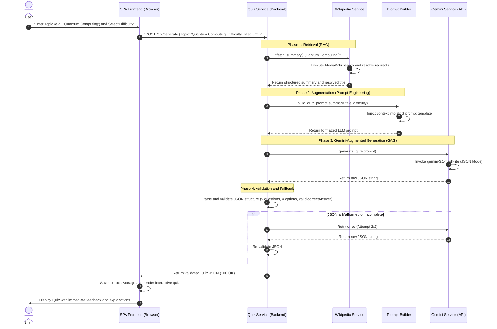

# 🧠 QuizGenius: AI-Powered Knowledge Quiz Builder (RAG/GAG MVP)

[](https://www.python.org/)
[](https://flask.palletsprojects.com/)
[](https://ai.google.dev/)
[-E34F26?style=flat-square&logo=html5&logoColor=white)](https://developer.mozilla.org/en-US/docs/Web/HTML)
[](https://opensource.org/licenses/MIT)

QuizGenius is an interview-ready, production-grade **Single Page Application (SPA)** that dynamically generates custom 5-question multiple-choice quizzes on any topic. 

By leveraging **Retrieval-Augmented Generation (RAG)** and **Gemini-Augmented Generation (GAG)**, the system retrieves factual, real-time reference articles from the Wikipedia API and injects them into **Google Gemini 3.1 Flash Lite**. This grounding mechanism eliminates AI hallucinations, ensuring that every question, answer option, and explanation is factually accurate and verified.

---

## 🗺️ System Architecture Diagrams

### 1. High-Level System Architecture
This diagram illustrates the flow of data and control between the client, the Flask API backend, and external data and AI services.

```mermaid
graph TB
    %% Styling
    classDef client fill:#e1f5fe,stroke:#0288d1,stroke-width:2px,color:#01579b;
    classDef server fill:#efebe9,stroke:#5d4037,stroke-width:2px,color:#3e2723;
    classDef external fill:#efebe9,stroke:#388e3c,stroke-width:2px,color:#1b5e20;
    classDef ai fill:#ede7f6,stroke:#7b1fa2,stroke-width:2px,color:#4a148c;
    
    subgraph Client [Client-Side Browser]
        A["🖥️ SPA Dashboard (HTML5 / Vanilla CSS)"]:::client
        G["💾 LocalStorage (Quiz History)"]:::client
    end
    
    subgraph Backend [Flask API Server]
        B["⚡ Flask App (app.py)"]:::server
        R["🛣️ Quiz Routes (quiz_routes.py)"]:::server
        S["🛠️ Quiz Service Orchestrator"]:::server
        P["📝 Prompt Builder"]:::server
    end
    
    subgraph External [External APIs]
        C["🌐 Wikipedia API (MediaWiki)"]:::external
        E["🤖 Google Gemini API"]:::ai
    end

    %% Flow connections
    A --> R
    R --> S
    S -->|2. Search and Fetch Summary| C
    C -->|3. Return Factual Summary| S
    S -->|4. Request Prompt Construction| P
    P -->|5. Return Prompt with Injected Context| S
    S -->|6. Call API in JSON Mode| E
    E -->|7. Generate Quiz JSON| S
    S -->|8. Validate and Sanitize JSON| S
    S -->|9. Send Validated Quiz JSON| R
    R -->|10. Return 200 OK Response| A
    A -->|11. Render UI and Persist Quiz| G
```



---

### 2. GAG (Gemini-Augmented Generation) & RAG Pipeline
The diagram below details the step-by-step pipeline showing how a user query is augmented with retrieved Wikipedia context and generated using Gemini's native JSON mode with built-in validation.



---

## 🛠️ System Architecture & Technical Decisions

The project is structured around a **decoupled Client-Server Architecture** with a clear separation of concerns, designed for high performance, low latency, and ease of deployment.

### 1. Layered Backend Service Architecture
The Flask backend is organized into a clean, service-oriented architecture:
*   **`routes/quiz_routes.py`**: Acts as the controller layer. It handles HTTP requests, validates input payloads, and maps backend exceptions to clean, user-friendly HTTP error responses.
*   **`services/quiz_service.py`**: The orchestrator. It manages the business logic, coordinates the RAG/GAG flow, implements a self-healing retry mechanism, and performs rigorous validation on the LLM's output.
*   **`services/wikipedia_service.py`**: The retrieval component. It interfaces with the Wikipedia API, handles query resolution, automatically resolves redirects, and extracts the plain text introduction.
*   **`services/gemini_service.py`**: The generative component. It initializes the Google GenAI SDK client and communicates with the Gemini model using optimized generation configurations.
*   **`utils/prompt_builder.py`**: A pure-functional utility that constructs the prompt. Separating prompt design from API logic makes it highly testable and maintainable.

### 2. Frontend SPA Hosted in `docs/`
The frontend is built as a Single Page Application (SPA) using vanilla web technologies (HTML5, CSS3, and JavaScript) located in the `/docs` directory. 
*   **Hosting Optimization**: Placing the frontend in `/docs` allows for seamless, zero-cost static hosting on platforms like **GitHub Pages** while the Flask backend can be deployed to serverless environments like **Vercel**.
*   **Vanilla Stack**: Avoiding heavy frameworks (like React or Vue) ensures near-instant page loads, zero build-step overhead, and maximum compatibility.
*   **Glassmorphism Design**: The CSS leverages modern design tokens, custom properties, HSL color schemes, backdrop filters (glassmorphism), and CSS animations to deliver a premium, responsive dark-mode user experience.

### 3. Serverless Compatibility
The backend is designed as an **Application Factory** (`create_app()`) and includes a `vercel.json` configuration. This enables it to run as a serverless function on Vercel, scaling automatically to zero when inactive and eliminating cold-start bottlenecks.

---

## 🤖 AI Tool Selection & Reasoning

```
┌─────────────────────────────────────────────────────────────────────────┐
│                          GOOGLE GEMINI 3.1 FLASH LITE                   │
│  ┌───────────────────────┬───────────────────────┬───────────────────┐  │
│  │     Ultra-Low Latency │  Native JSON Mode     │  Strict Grounding │  │
│  │     ~1.5s generation  │  No regex parsing     │  Zero-Hallucination│  │
│  └───────────────────────┴───────────────────────┴───────────────────┘  │
└─────────────────────────────────────────────────────────────────────────┘
```

For the generative core of QuizGenius, **Google Gemini 3.1 Flash Lite** (`gemini-3.1-flash-lite`) was selected. Below is the technical reasoning behind this choice:

### 1. Extreme Speed and Low Latency
Interactive user experiences demand fast response times. Gemini 3.1 Flash Lite is optimized for speed, generating a complete 5-question quiz with options and explanations in **under 1.5 seconds**. This is significantly faster than larger models (like Gemini Pro or GPT-4) while maintaining the intelligence required for educational synthesis.

### 2. Native JSON Mode
Parsing LLM outputs using regular expressions or string splitting is notoriously fragile. Gemini 3.1 Flash Lite supports native structured outputs by setting the configuration parameter `response_mime_type="application/json"`. 
This forces the model's decoding layers to output a syntactically valid JSON string. The model is guaranteed to return a JSON array conforming to our required schema, preventing runtime errors on the frontend.

### 3. In-Context Learning & Grounding (RAG/GAG)
By feeding the retrieved Wikipedia summary directly into the prompt context, we ground the model's knowledge base. Gemini 3.1 Flash Lite exhibits excellent instruction-following capabilities. It adheres strictly to the provided context and does not inject external, unverified information, making the quizzes highly reliable.

### 4. Generous Free Tier & Cost Efficiency
For an MVP or public-facing portfolio project, operating costs are a key consideration. Gemini 3.1 Flash Lite offers a highly generous free tier via Google AI Studio, making it the most cost-effective choice for developers.

---

## 📂 Project Directory Structure

```text
quiz-builder/
├── backend/                  # Flask API Backend
│   ├── app.py                # Application factory & entrypoint
│   ├── config.py             # App configuration & env validation
│   ├── vercel.json           # Serverless deployment configuration
│   ├── requirements.txt      # Python dependencies
│   ├── .env.example          # Template for environment variables
│   ├── routes/
│   │   └── quiz_routes.py    # API endpoints & HTTP error mapping
│   ├── services/
│   │   ├── gemini_service.py     # Gemini API client & configuration
│   │   ├── wikipedia_service.py  # Wikipedia search & summary retrieval
│   │   └── quiz_service.py       # RAG orchestrator & schema validator
│   └── utils/
│       └── prompt_builder.py     # Context injection & prompt engineering
│
├── docs/                     # Frontend Single Page Application (SPA)
│   ├── index.html            # Main dashboard & interactive UI
│   ├── css/
│   │   └── style.css         # Premium Glassmorphism & Responsive styling
│   └── js/
│       └── app.js            # Frontend state, API client, & local storage
│
└── README.md                 # Project documentation
```

---

## 🔌 API Endpoints

### 1. Health Check
*   **Endpoint**: `GET /health`
*   **Description**: Verifies that the Flask API and its configurations are loaded and running.
*   **Response (200 OK)**:
    ```json
    {
      "status": "healthy",
      "message": "AI Powered Knowledge Quiz Builder API is running."
    }
    ```

### 2. Generate Quiz
*   **Endpoint**: `POST /api/generate`
*   **Description**: Retrieves context for the requested topic, builds a grounded prompt, invokes Gemini, validates the output, and returns the quiz.
*   **Request Headers**: `Content-Type: application/json`
*   **Request Body**:
    ```json
    {
      "topic": "Quantum Computing",
      "difficulty": "Hard"
    }
    ```
*   **Response (200 OK)**:
    ```json
    {
      "topic": "Quantum Computing",
      "difficulty": "Hard",
      "generation_time": 1.42,
      "context": "Quantum computing is a multidisciplinary field comprising aspects of computer science, physics, and mathematics...",
      "questions": [
        {
          "question": "Which quantum mechanical phenomenon allows qubits to exist in multiple states simultaneously?",
          "options": [
            "Superposition",
            "Entanglement",
            "Tunneling",
            "Decoherence"
          ],
          "correctAnswer": "Superposition",
          "explanation": "Superposition allows a quantum system to be in multiple states at the same time until it is measured.",
          "category": "Quantum Computing"
        }
      ]
    }
    ```

*   **Error Responses**:
    *   `400 Bad Request`: Missing or empty `topic` parameter.
    *   `404 Not Found`: No matching Wikipedia article found for the topic.
    *   `502 Bad Gateway`: External API failure (e.g., Gemini API key invalid, rate limits).
    *   `500 Internal Server Error`: Quiz JSON could not be validated or repaired.

---

## 🚀 Setup & Installation

### 1. Prerequisites
*   **Python 3.9+** installed.
*   A **Google Gemini API Key** (Get one for free at [Google AI Studio](https://aistudio.google.com/)).

### 2. Backend Setup
1.  Navigate to the backend directory:
    ```bash
    cd backend
    ```
2.  Create and activate a virtual environment:
    ```bash
    python -m venv venv
    # Windows:
    venv\Scripts\activate
    # macOS/Linux:
    source venv/bin/activate
    ```
3.  Install the dependencies:
    ```bash
    pip install -r requirements.txt
    ```
4.  Configure your environment:
    *   Copy the `.env.example` file to a new file named `.env`:
        ```bash
        cp .env.example .env
        ```
    *   Open `.env` and enter your Gemini API Key:
        ```env
        GEMINI_API_KEY=your_actual_api_key_here
        FLASK_PORT=5000
        FLASK_DEBUG=True
        WIKIPEDIA_USER_AGENT=QuizGeniusApp/1.0 (your-email@example.com)
        ```
5.  Start the Flask server:
    ```bash
    python app.py
    ```
    The backend will run at `http://localhost:5000`.

### 3. Frontend Setup
You can serve the frontend SPA locally:
1.  Navigate to the `docs` directory:
    ```bash
    cd ../docs
    ```
2.  Start a simple local server:
    ```bash
    python -m http.server 8000
    ```
3.  Open `http://localhost:8000` in your web browser.
*Note: Since CORS is fully configured on the backend, you can also open `docs/index.html` directly in your browser using the `file://` protocol.*

---

## 🛡️ Robustness & Fault Tolerance

QuizGenius is built to be resilient against network and LLM generation failures:

*   **Self-Healing JSON Retries**: If Gemini returns a response that fails JSON parsing or does not match the required schema (e.g. missing keys, incorrect option counts), the `QuizService` catches the error, logs it, and automatically triggers a second attempt.
*   **Wikipedia API Backoff**: Network calls to Wikipedia are protected by a retry loop with **exponential backoff** (up to 3 attempts), mitigating transient DNS or rate-limiting issues.
*   **Strict Type and Value Sanitization**: The backend verifies that:
    1.  Exactly 5 questions are returned.
    2.  Each question contains exactly 4 options.
    3.  The `correctAnswer` matches one of the 4 options (with a case-insensitive fallback mapping).
    4.  All fields are non-empty strings.